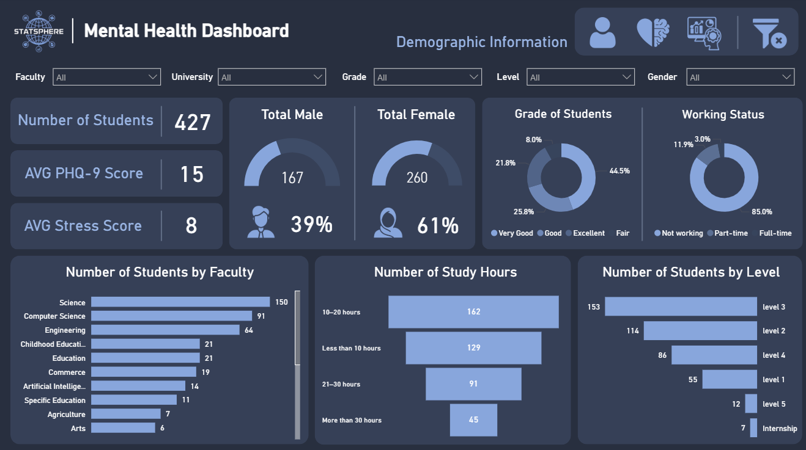
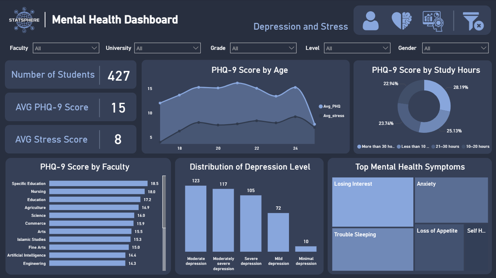
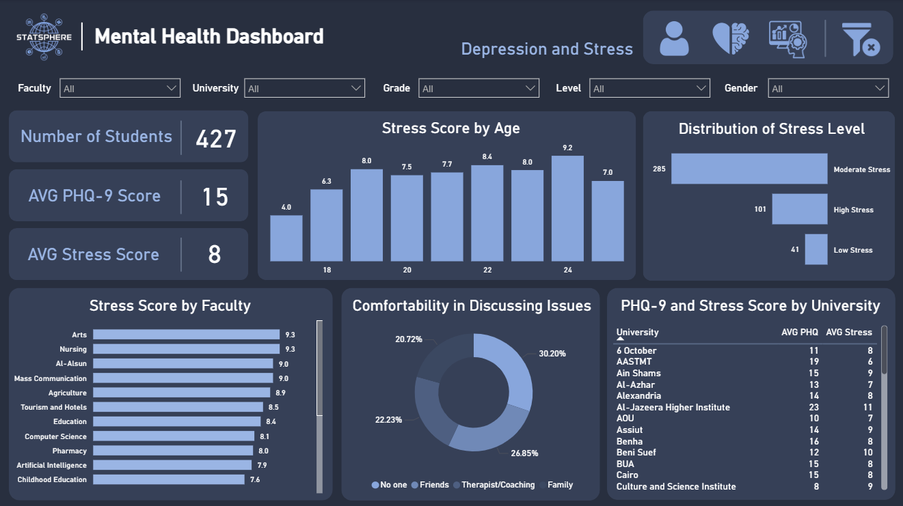

# 🎓📖 The Impact of Academic Stress on Mental Health Among Egyptian University Students
  
Graduation Project from DEPI Google Data Analysis Track

---

## 📖 Table of Contents

1. [Executive Summary](#-executive-summary)  
2. [Project Objectives](#-project-objectives)  
3. [Dataset Overview](#-dataset-overview)  
4. [Project Questions](#-project-questions)  
5. [Technologies & Tools](#-technologies--tools)  
6. [Methodology](#-methodology)  
7. [Scoring System](#-scoring-system)  
8. [Key Performance Indicators (KPIs)](#-key-performance-indicators-kpis)  
9. [Dashboard Snapshots](#-dashboard-snapshots)  
10. [Project Timeline & Milestones](#-project-timeline--milestones)  
11. [Deliverables](#-deliverables)  
12. [Roles & Responsibilities](#-roles--responsibilities)  
13. [Future Enhancements](#-future-enhancements)  
14. [Contact Information](#-contact-information)  

---

## 📌 Executive Summary

This project investigates how academic stress impacts mental health among Egyptian university students. Using survey responses, we analyzed depression levels, stress intensity, and emotional expression comfort. The findings highlight major mental health risks and propose institutional recommendations to improve student well-being.

---

## 🏆 Project Objectives

- Assess depression using PHQ-9 scores and self-reported stress.
- Examine links between academic/social factors and mental health.
- Analyze expression comfort and its impact on coping.
- Provide actionable insights for university mental health support.

---

## 📁 Dataset Overview

🔗 **Survey Link:** [Academic Stress & Mental Health Survey](https://forms.gle/Xb5G8VbuFkk7n6ri8)  

The dataset includes anonymized responses from Egyptian university students enrolled in Bachelor's, Diploma, Master's, and Ph.D. programs. Variables include:

- PHQ-9 Depression Scores  
- Self-reported Stress Levels  
- Expression Comfort with Family, Friends, Therapists  
- Academic Load and Social/Demographic Factors  

---

## 📝 Project Questions

- What is the relationship between academic stress and mental health?
- Which factors contribute most to psychological distress?
- How comfortable are students expressing emotions?
- Why do students avoid seeking professional help?
- What support systems should universities implement?

---

## 🛠 Technologies & Tools

| Function               | Tools                    |
|------------------------|--------------------------|
| Data Collection        | Google Forms             |
| Data Cleaning          | AppScript (JavaScript)   |
| Data Transformation    | Power Query (M Language) |
| Data Analysis          | Python (Jupyter Notebook)|
| Visualization          | Power BI                 |
| Version Control        | Git, GitHub              |

---

## 🔬 Methodology

- **Data Collection** via Google Forms.
- **Cleaning & Transformation** using JavaScript and Power Query.
- **Scoring**: Computation of PHQ-9, Stress Level, and Expression Comfort.
- **Analysis**: EDA, correlations, and insights.
- **Visualization** through interactive Power BI dashboards.

---

## 📐 Scoring System

### 🧠 PHQ-9 Depression Score
Each of 9 questions is rated on a 4-point scale:
- 0 = Not at all  
- 1 = Several days  
- 2 = More than half the days  
- 3 = Nearly every day  

**Score Ranges:**
- 0–4: Minimal depression  
- 5–9: Mild  
- 10–14: Moderate  
- 15–19: Moderately severe  
- 20–27: Severe  

---

### 😟 Stress Level Score
Students rated their stress on a 1–5 Likert scale across factors:
- Family expectations  
- Financial issues  
- Fear of unemployment  
- Work-study balance  

**Total Score Classification:**
- 0–4: Low stress  
- 5–9: Moderate stress  
- 10–20: High stress  

---

### 💬 Expression Comfort Score
Comfort in expressing emotions to:
- Family  
- Friends  
- Therapists  
- No one  

**Scoring:**
- Comfortable = 1  
- Neutral = 0  
- Uncomfortable = -1  
- Very Uncomfortable = -2  

**Aggregate Score Classification:**
- ≥ 3: Very Comfortable  
- 0 to 2: Neutral  
- < 0: Uncomfortable  

---

## 📊 Key Performance Indicators (KPIs)

- Depression prevalence (PHQ-9)
- Stress intensity levels
- Gender & demographic comparison
- Expression comfort average
- Help-seeking behavior

---

## 📈 Dashboard Snapshots

*Breakdown by demographic and academic factors*

  
*Overall PHQ-9 trends*

  
*Overall stress trends*

---

## 📅 Project Timeline & Milestones

| Phase               | Duration   |
|---------------------|------------|
| Data Collection     | Week 1–2   |
| Cleaning & Prep     | Week 2–3   |
| Analysis            | Week 4–5   |
| Visualization       | Week 6     |
| Reporting           | Week 7     |

---

## 🚀 Deliverables

- 🗃 Cleaned Dataset  
- 📊 Power BI Dashboards  
- 📄 [Research Paper (PDF)](Media/ResearchPaper.pdf)  
- 📽 [Presentation Slides (PDF)](Media/PresentationSlides.pdf)  
- 📝 Recommendations Document  

---

## 👥 Roles & Responsibilities

| Team Member                                                                 | Role                      |
|------------------------------------------------------------------------------|---------------------------|
| [Ahmed Elmekawy](https://www.linkedin.com/in/ahmed-el-mekawy)               | Data Cleaning & Preparation |
| [Abdelrahmen Elashry](https://www.linkedin.com/in/abdelrahmen-elashry)     | Power BI & Visualization  |
| [Hajar Hasaballah](https://www.linkedin.com/in/hajar-hasaballa)            | Survey Design & Research  |
| [Mariam Rabi](https://www.linkedin.com/in/mariam-mmr)                       | ML Insights & Documentation |

---

## 🔮 Future Enhancements

- Larger sample across more universities
- Longitudinal studies (pre/post exams)
- Real-time dashboard integration
- Predictive AI for early stress detection

---

## 📩 Contact Information

📧 Email: [statsphereteam@gmail.com](mailto:statsphereteam@gmail.com)  
🔗 GitHub: [github.com/statsphere-project](https://github.com/statsphere-project)

---

**© 2025 Statsphere Team — All Rights Reserved.**
