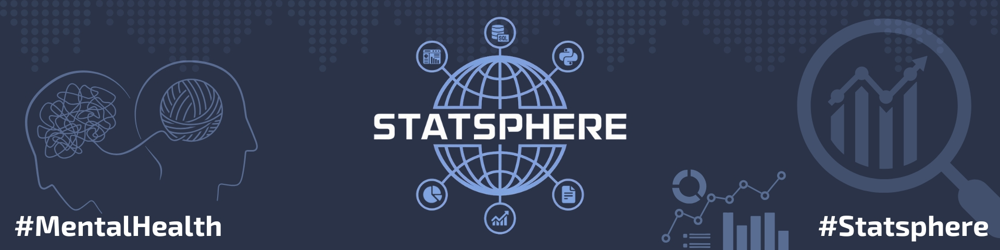

# 🎓📖 The Impact of Academic Stress on Mental Health Among Egyptian University Students
  
Graduation Project from DEPI Google Data Analysis Track

## 📖 Table of Contents

1. [Executive Summary](#-executive-summary)
2. [Project Objectives](#-project-objectives)
3. [Dataset Overview](#-dataset-overview)
4. [Project Questions](#-project-questions)
5. [Technologies & Tools](#-technologies--tools)
6. [Methodology](#-methodology)
7. [Key Performance Indicators (KPIs)](#-key-performance-indicators-kpis)
8. [Dashboard Snapshots](#-dashboard-snapshots)
9. [Project Timeline & Milestones](#-project-timeline--milestones)
10. [Deliverables](#-deliverables)
11. [Roles & Responsibilities](#-roles--responsibilities)
12. [Future Enhancements](#-future-enhancements)
13. [Contact Information](#-contact-information)

## 📌 Executive Summary

This project analyzes the impact of academic stress on the mental health of Egyptian university students using survey data, statistical analysis, and interactive dashboards. It identifies key factors such as demographic variables, workload, and social support, offering recommendations for institutional intervention.

## 🏆 Project Objectives

- Measure depression using PHQ-9 scores and stress levels.
- Explore how academic, demographic, and social factors relate to mental health.
- Understand students' comfort in expressing emotions.
- Provide recommendations for universities to improve mental health support.

## 📁 Dataset Overview

🔗 **Survey Link:** [Academic Stress & Mental Health Survey](https://forms.gle/uexw33saHBJL1rqn7)

The dataset contains responses from Egyptian university students across different degrees (Bachelor’s, Diploma, Master’s, Ph.D.) covering:

- **PHQ-9 Depression Scores**  
- **Self-reported Stress Levels**  
- **Expression Comfort with Family, Friends, and Professionals**  
- **Demographic and Academic Data**

## 📝 Project Questions

- What is the relationship between academic stress and mental health (PHQ-9, stress scores)?
- Which factors (e.g., gender, academic level, social support) contribute most to stress?
- How comfortable are students expressing emotions, and how does this affect coping?
- What barriers exist to seeking help?
- What can universities do to reduce academic stress?

## 🛠 Technologies & Tools

| Functionality         | Tools             |
| --------------------- | ---------------- |
| Data Collection       | Google Forms      |
| Data Cleaning         | AppScript (JS)    |
| Data Transformation   | Power Query (M)   |
| Data Analysis         | Jupyter Notebook  |
| Data Visualization    | Power BI          |
| Version Control       | Git, GitHub       |

## 🔬 Methodology

- **Data Collection**: Structured online survey.
- **Data Cleaning**: Automated scripts for consistency.
- **Data Transformation**: Standardization and numerical coding.
- **Scoring**: PHQ-9, Stress Level, Expression Comfort.
- **Visualization**: Interactive dashboards.
- **Interpretation**: EDA & ML :Insights and recommendations based on quantitative analysis.

## 📊 Key Performance Indicators (KPIs)

- Prevalence of depression (PHQ-9).
- Self-reported stress levels.
- Correlation between workload and mental health.
- Help-seeking rates.
- Gender, marital status, and living situation comparisons.

## 📈 Dashboard Snapshots

Here are sample views of our Power BI dashboards:

  
*Overall PHQ-9 and stress trends*

  
*Breakdown by demographic and academic factors*

## 📅 Project Timeline & Milestones

| Phase            | Duration   |
| ---------------- | ---------- |
| Data Collection  | Week 1-2   |
| Cleaning & Prep  | Week 2-3   |
| Analysis         | Week 4-5   |
| Visualization    | Week 6     |
| Reporting        | Week 7     |

## 🚀 Deliverables

- Clean dataset
- Statistical report
- Power BI dashboards
- Final research paper
- Presentation slides
- Recommendations for universities

## 👥 Roles & Responsibilities

| Team Member                             | Role                      |
| --------------------------------------- | ------------------------- |
| [Ahmed Elmekawy](https://www.linkedin.com/in/ahmed-el-mekawy)           |Data Cleaning & Preparation  |
| [Abdelrahmen Elashry](https://www.linkedin.com/in/abdelrahmen-elashry) | Visualization Specialist  |
| [Hajar Hasaballah](https://www.linkedin.com/in/hajar-hasaballa)         | Research & Survey Lead    |
| [Mariam Rabi](https://www.linkedin.com/in/mariam-mmr)                   | ML & Documentation Lead   |

## 🔮 Future Enhancements

- Extend sample size across Egyptian universities.
- Add longitudinal tracking to measure changes over time.
- Build AI models for early stress detection.
- Create a real-time mental health dashboard.

## 📩 Contact Information

📧 Email: [statsphereteam@gmail.com](mailto:statsphereteam@gmail.com)

---

**© 2025 Statsphere Team. All rights reserved.**
